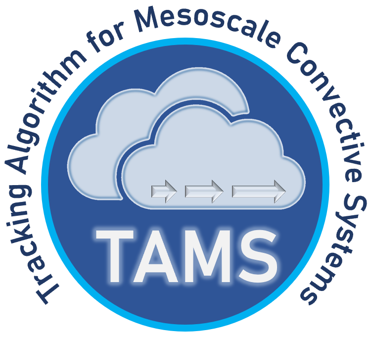

<h1>
  <!-- 
  
</h1>

TAMS
(**T**racking **A**lgorithm for [**M**esoscale Convective **S**ystems](https://en.wikipedia.org/wiki/Mesoscale_convective_system))
in Python and with more flexibility.

- TAMS paper to cite: Núñez Ocasio et al. 2020, doi:[10.1175/MWR-D-19-0070.1](https://doi.org/10.1175/MWR-D-19-0070.1)

- If you are interested in the original TAMS version (TAMS v1.0), please email `knocasio@ucar.edu`
